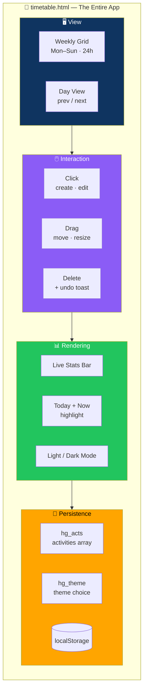

# ⏳ Hourglass — Weekly 24-Hour Timetable Planner

<div align="center">


**Plan your week, hour by hour.**

*Monday through Sunday · Click to create · Drag to move · Resize to extend*

[✨ Features](#-features-included) • [🚀 Running It](#-running-it) • [🗄️ Data Model](#-data-model) • [🗺️ Not Included](#-not-included-in-this-build)

</div>

---

## 📖 Overview

**Hourglass** is a **single-file, self-contained web app** for planning your week hour by hour, **Monday through Sunday**.

> **No build step. No server. No dependencies.**
>
> The whole app is one HTML file with inline CSS and JavaScript.

### Core Idea

> **Click. Drag. Done.**
>
> Every interaction is direct — click a slot to create, drag to move, drag the edge to resize, undo with one tap. Nothing gets in the way of actually planning your week.

---

## 🚀 Running It

**No build step, no server, no dependencies.**

1. Download **`timetable.html`**
2. **Double-click it** — or open it in any modern browser

**That's it.**

---

## 📁 Files

```
timetable.html   the entire app (markup, styles, logic)
README.md        this file
```

---

## ✨ Features Included

<div align="center">

| 📅 Weekly Grid | 📆 Day View |
|:---:|:---:|
| Mon–Sun · 00:00–23:59 · scrollable · today and current time highlighted | Single day in detail with prev/next navigation · opens by default on narrow/mobile screens |
| **🖱️ Click to Create** | **✏️ Click to Edit** |
| Click any time slot to create an activity | Click an existing activity to edit it |
| **🖐️ Drag & Drop** | **📏 Resize** |
| Drag an activity to a new time or day | Drag the bottom edge to change duration · **snapped to 15-minute increments** |
| **↩️ Delete with Undo** | **🎨 12 Built-In Categories** |
| Delete any activity · **5-second Undo toast** | Sleep · Study · Work · Exercise · Food · Travel · Entertainment · Personal · Coding · Language · Reading · Other |
| **📊 Live Stats Bar** | **🌗 Light / Dark Mode** |
| Total scheduled hours · free hours · top categories by time spent · recalculated on every change | Toggle · **respects your system preference by default** · persisted across visits |
| **💾 Persistence** | **🎨 Custom Colors** |
| Everything saved to `localStorage` — your schedule survives a refresh | Pick any swatch color per activity |
| **📱 Responsive** | **🎯 Today Highlighted** |
| Weekly grid + focused day view · auto-selects day view on mobile | Today and the current time are visually distinct |

</div>

### 📅 The Weekly Grid

- **Monday through Sunday**
- **00:00 to 23:59** — full 24-hour coverage
- **Scrollable** — no vertical cramping
- **Today highlighted**
- **Current time highlighted**

### 📆 The Day View

- **A single day in detail**
- **Prev / next navigation**
- **Opens by default on narrow / mobile screens** — so you're never fighting the grid on a phone

### 🎯 Interaction Model

| Action | How |
|--------|-----|
| **Create** | Click any empty time slot |
| **Edit** | Click an existing activity |
| **Move** | Drag an activity to a new time or day |
| **Resize** | Drag the bottom edge — snapped to **15-minute increments** |
| **Delete** | Delete button, with a **5-second Undo toast** |

### 🎨 Categories

**12 built-in categories**, each with an emoji and color:

| | | | |
|:---:|:---:|:---:|:---:|
| 😴 **Sleep** | 📚 **Study** | 💼 **Work** | 🏃 **Exercise** |
| 🍽️ **Food** | ✈️ **Travel** | 🎬 **Entertainment** | 🙋 **Personal** |
| 💻 **Coding** | 🌐 **Language** | 📖 **Reading** | ✨ **Other** |

**Plus:** pick any swatch color per activity — go beyond the category default.

### 📊 Live Stats Bar

**Recalculated on every change:**

- **Total scheduled hours**
- **Free hours**
- **Your top categories by time spent**

### 🌗 Light / Dark Mode

- **Toggle** to switch
- **Respects your system preference by default**
- **Persisted** across visits

### 💾 Persistence

**Everything is saved to the browser's `localStorage`** — your schedule survives a refresh.

> 🔒 **Nothing is sent to a server.**

---

## 🗄️ Data Model

Each activity is stored as:

```json
{
  "id": "1732650000000",
  "title": "English Study",
  "day": 0,
  "start": "09:00",
  "end": "10:00",
  "cat": "Language",
  "color": "#B45A8C",
  "desc": ""
}
```

### Field Reference

| Field | Type | Notes |
|-------|------|-------|
| `id` | string | Timestamp-based, unique per activity |
| `title` | string | Activity name |
| `day` | number | **0–6 for Monday–Sunday** |
| `start` | string | `HH:MM` format |
| `end` | string | `HH:MM` format |
| `cat` | string | Category name |
| `color` | string | Hex color |
| `desc` | string | Optional description |

### Storage Keys

| Key | Contains |
|-----|----------|
| `hg_acts` | All activities — one array |
| `hg_theme` | Theme choice |

### Architecture



---

## 🗺️ Not Included in This Build

> **To keep the first version fast to build and easy to read, these items from the original brief were left out.**
>
> **Each would be a self-contained addition to the same file.**

<div align="center">

| Feature | Status |
|---------|:------:|
| **Monthly calendar overview** | 🔜 Planned |
| **Schedule templates** — save / apply a week layout | 🔜 Planned |
| **Recurring activities** — repeat rules | 🔜 Planned |
| **Export to PDF / CSV / JSON** | 🔜 Planned |
| **Print stylesheet** | 🔜 Planned |
| **Reminders / notifications** | 🔜 Planned |
| **Search and category filtering** | 🔜 Planned |
| **Copy / duplicate a day or week** | 🔜 Planned |
| **Clear a day / week** | 🔜 Planned |
| **Keyboard shortcuts** — `N`, `T`, `W`, `D`, arrows, `Delete`, `Esc` | 🔜 Planned |
| **Overlap warnings** between activities | 🔜 Planned |

</div>

> 💡 **Let me know which of these you'd like added next and I'll build it into the same file.**

---

## 🌐 Browser Support

**Any current version of:**

- Chrome
- Firefox
- Safari
- Edge

> 💡 **Uses standard HTML5 drag-and-drop and `localStorage`** — no external libraries, no network requests.

---

## 🗺️ Roadmap

### ✅ Current

- [x] Weekly grid — Mon–Sun, 00:00–23:59, scrollable
- [x] Today and current time highlighted
- [x] Day view with prev/next navigation
- [x] Day view opens by default on narrow/mobile screens
- [x] Click a time slot to create an activity
- [x] Click an existing activity to edit it
- [x] Drag and drop activities to a new time or day
- [x] Resize activities with 15-minute snapping
- [x] Delete with a 5-second Undo toast
- [x] 12 built-in categories with emoji and color
- [x] Custom color swatch per activity
- [x] Live stats bar with total hours, free hours, and top categories
- [x] Light/dark mode toggle with system preference detection
- [x] Persistence via `localStorage`
- [x] Responsive layout
- [x] Single-file, zero-dependency, offline-capable

### 🔜 Not Yet Included

- [ ] Monthly calendar overview
- [ ] Schedule templates
- [ ] Recurring activities
- [ ] Export to PDF / CSV / JSON
- [ ] Print stylesheet
- [ ] Reminders / notifications
- [ ] Search and category filtering
- [ ] Copy / duplicate a day or week
- [ ] Clear a day / week
- [ ] Keyboard shortcuts
- [ ] Overlap warnings

---

## 🤝 Contributing

Contributions are welcome. Please:

1. Fork the repository
2. **Keep it single-file** — no external dependencies or build steps
3. **Keep it offline-first** — no network requests, no external APIs
4. **Preserve the 15-minute snap** on drag and resize
5. **Preserve the Undo toast** on delete
6. Test on both desktop and mobile
7. Submit a Pull Request

### Guidelines

- **Never add a required external dependency**
- **Never send data to a server** — `localStorage` is the persistence layer
- **Never break the day view on mobile** — it opens by default for a reason
- **Never lose an activity without undo** — the 5-second window is the safety net
- **Preserve the 15-minute grid** — everything snaps to it

---

## 📜 License

MIT — free to use, modify, and distribute.

---

## 🙏 Acknowledgments

- **HTML5 drag-and-drop** — for making direct manipulation possible without a framework
- **`localStorage`** — for persistence without a backend
- **Every planner who's ever wanted a 24-hour grid** — this is for you

---

<div align="center">

### ⏳ CLICK. DRAG. PLAN. DONE.

**Plan your week, hour by hour.**

**One file. Zero dependencies. Works offline.**

<br>

⭐ If this planner helped you, consider giving it a star.

<br>

[⬆ Back to Top](#️-hourglass--weekly-24-hour-timetable-planner)

</div>
